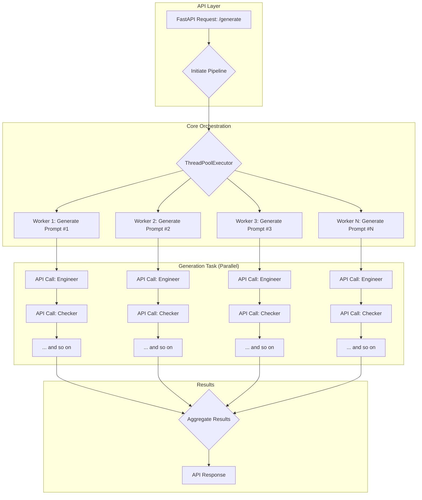
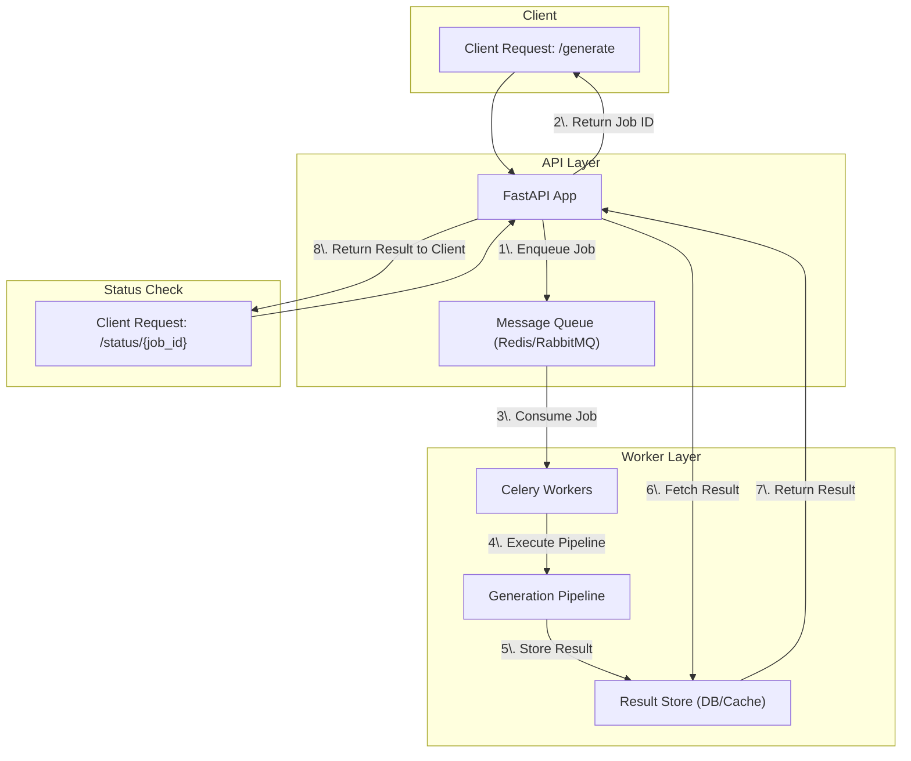

# Backend Optimization Strategies

This document outlines two distinct architectural approaches to optimize the backend for efficiency and speed.

### **Analysis Summary**

* **Architecture:** The application uses a synchronous, sequential pipeline to generate synthetic prompts. A FastAPI endpoint triggers a service that calls a core orchestration function.
* **Data Flow:** `app/main.py` -> `app/api/routes.py` -> `app/services/pipeline_service.py` -> `core/runner.py` -> `core/orchestration/generate_batch.py`.
* **Primary Bottleneck:** The `while` loop in `core/orchestration/generate_batch.py` contains sequential, blocking API calls to LLMs (`call_engineer`, `call_checker`, `call_target_model`). This makes the process inherently slow as it can only work on one prompt at a time, spending most of its execution waiting for network I/O.

---

### **Proposed Optimization Strategies**

Here are two architectural solutions to this bottleneck.

#### **Approach 1: Concurrent Processing via Parallelization**

This approach focuses on executing the generation process for multiple prompts at the same time, rather than one after the other.

* **Description:** We will refactor the core pipeline to use a `ThreadPoolExecutor` from Python's `concurrent.futures` library. Instead of a `while` loop, we will create a pool of worker threads and submit a generation task for each requested prompt. This allows many prompts to be processed in parallel, with each thread handling the sequence of API calls for a single prompt.
* **Benefits:**
  * **Significant Speed Improvement:** The total time to generate a batch of prompts will be dictated by the duration of the longest single generation task, not the sum of all tasks. This is a massive performance gain for I/O-bound operations.
  * **High Scalability:** The number of parallel workers can be easily configured to maximize throughput based on API rate limits and server resources.
* **Drawbacks:**
  * **Increased Complexity:** Requires careful management of threads and result aggregation. Error handling becomes more complex, as we need to manage failures in individual threads without crashing the entire pipeline.
  * **Resource Intensive:** Can lead to spikes in CPU and memory usage. It also risks hitting API rate limits if not managed carefully with a configurable number of workers.
* **Key Files for Modification:**
  * `core/orchestration/generate_batch.py`: The `run_generation_pipeline` function will be heavily modified. The `while` loop will be replaced with a `ThreadPoolExecutor` to manage parallel execution. The logic inside the current loop will be extracted into a separate function representing a single task.
  * `core/runner.py`: May require minor adjustments to handle the aggregated results returned from the parallel pipeline.

---

#### **Approach 2: Asynchronous Processing with a Job Queue**

This approach redesigns the system to be fully asynchronous, providing immediate API responses and processing tasks in the background.

* **Description:** This architecture introduces a message queue (like Celery with Redis or RabbitMQ) to decouple the API from the heavy processing.
    1. The `/generate` endpoint will receive a request, create a job, and push it to the queue. It will then immediately return a `202 Accepted` response with a unique `job_id`.
    2. A separate pool of worker processes will listen for jobs on the queue. When a job is received, a worker will execute the generation pipeline.
    3. The results will be stored in a database or cache, keyed by the `job_id`.
    4. The client can poll a new `/status/{job_id}` endpoint to check the job's status and retrieve the results once ready.
* **Benefits:**
  * **Enhanced API Responsiveness:** The API becomes non-blocking, providing an immediate response to the client and preventing timeouts. This dramatically improves the user experience.
  * **Robustness and Reliability:** Jobs in a queue are persistent. If a worker or the app crashes, the job can be retried automatically, preventing data loss.
  * **Superior Scalability:** The number of web servers and background workers can be scaled independently, allowing the system to handle high request volumes and heavy processing loads efficiently.
* **Drawbacks:**
  * **Major Architectural Change:** This is a significant increase in complexity, requiring the introduction and management of new infrastructure components (message broker, result backend, worker processes).
  * **Infrastructure Overhead:** Adds operational burden for deployment, monitoring, and maintenance of the queue and workers.
  * **Asynchronous Client Logic:** The client must be designed to handle an asynchronous workflow (making the initial request, then polling for the result).
* **Key Files for Modification:**
  * `app/api/routes.py`: The `/generate` endpoint will be rewritten to dispatch a job to the queue. A new `/status/{job_id}` endpoint will be created.
  * `app/services/pipeline_service.py`: The `run_pipeline` function will be adapted to become the task executed by the background workers.
  * `requirements.txt`: New dependencies like `celery` and `redis` will be added.
  * **New Files:** A `worker.py` file will be needed to define and run the Celery workers, and a configuration file (e.g., `app/celery_app.py`) will be required to set up the Celery instance.
