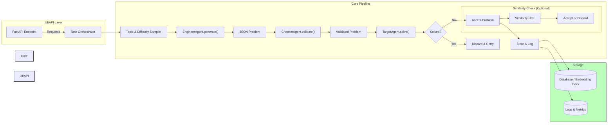
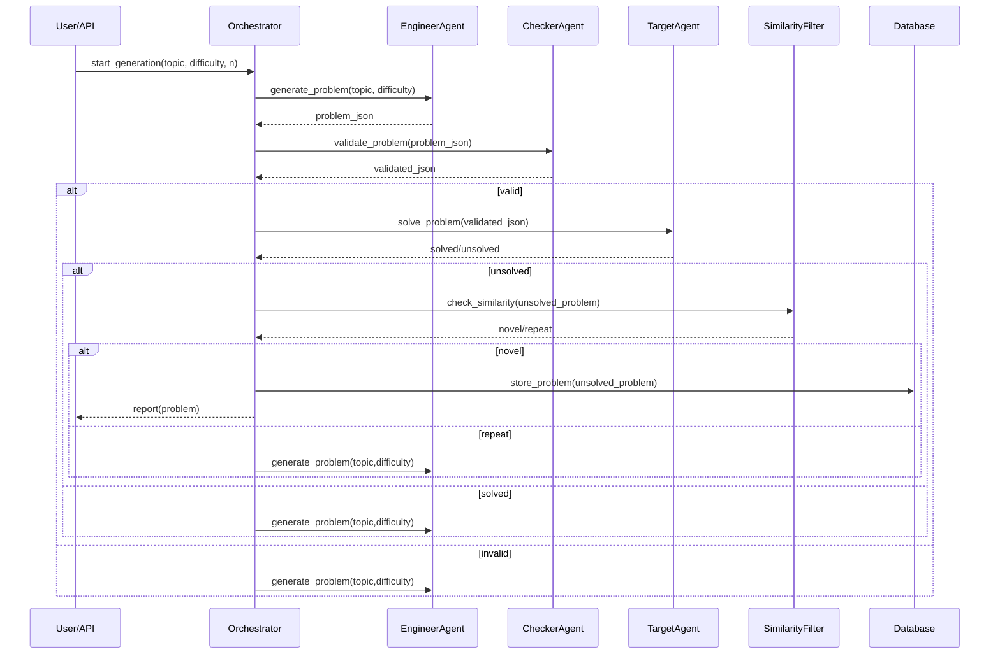

# Improvement Plan: Synthetic Math Prompts Agent

This roadmap outlines a clear set of strategic enhancements for the Synthetic Math Prompts Agent, targeting code maintainability, system performance, and the generation of diverse, curriculum-appropriate math challenges that consistently test advanced AI models. It also presents refined architecture and workflow diagrams to visualize the updated implementation plan.

---

## 1. Code Structure & Maintainability

1. **Consolidate LLM API Calls**

   * Create a central `llm_client.py` in `core/` that handles authentication, request/response, retry/backoff, and logging for all models (OpenAI, Gemini).
   * Refactor existing calls in `engineer.py`, `checker.py`, and `target.py` to use `llm_client.call_model(model_name, prompt, **kwargs)`.

2. **Define Agent Classes**

   * Implement classes: `EngineerAgent`, `CheckerAgent`, `TargetAgent` in `core/agents.py`.
   * Each class holds its model config, system prompt, and methods like `generate()`, `validate()`, and `solve()`.

3. **Centralize Configuration**

   * Move `.env` loading into `utils/config_loader.py`.
   * Expose a singleton `Config` object with attributes: `OPENAI_KEY`, `GEMINI_KEY`, `MODELS = {engineer: ..., checker: ..., target: ...}`, `DEFAULT_WORKERS`, etc.

4. **Enhance Logging & Remove Prints**

   * Replace all `print()` statements with structured logging via `utils/logging_config`.
   * Include context (thread id, job id) in log entries.
   * Add metrics for timing each stage (engineer call, checker call, target call).

5. **Enforce Type Hints & Docstrings**

   * Add type annotations to all public functions in `core/` and `utils/`.
   * Provide docstrings describing parameters, return types, and exceptions.

6. **Expand Unit Tests**

   * Write tests for: taxonomy loading/validation, prompt parsing, JSON safety parsing, and a mock end-to-end simulation using stubbed LLM responses.

---

## 2. Performance & Efficiency

1. **Adaptive ThreadPool**

   * Monitor success/discard rates and dynamically adjust `max_workers` within bounds (e.g., 5–20).
   * Implement a shared `stop_event` to abort remaining tasks when target count reached.

2. **Batch Problem Generation (Optional)**

   * Update the engineer prompt to request multiple candidates per call (e.g., 3 problems at once).
   * Parse and enqueue them for parallel checker/target evaluation.

3. **Deterministic Target Model**

   * Set `temperature=0` for the target to avoid fluke failures.
   * Standardize the target prompt to request final answer only, but allow internal chain-of-thought via a hidden parameter if supported.

4. **Pre-filter Easy Problems**

   * Implement a heuristic/difficulty estimator: if the answer is a simple numeric result or single-step, skip calling the target to reduce API usage.

5. **Similarity Check Optimization**

   * Offer an option to disable `use_search` entirely for faster runs.
   * Alternatively, switch to an offline embedding index for known problem database and only fallback to Tavily if needed.

6. **Cost & Token Reduction**

   * Shorten engineer system messages by consolidating criteria.
   * Experiment with lighter models (e.g., GPT-3.5) for the checker role if accuracy remains acceptable.

---

## 3. Math Problem Generation Quality

1. **Level-Aware Prompting**

   * Augment the engineer prompt with difficulty context, e.g., `"This is a High School Algebra problem, challenging but within HS curriculum."`
   * Attach the difficulty level from an enriched taxonomy: `{topic: {description: ..., level: "HighSchool"}}`.

2. **Taxonomy Metadata Enhancement**

   * Refactor `utils/taxonomy.py` to support `{subject: {topic: {level, description}}}`.
   * Validate taxonomy on load and reject unknown levels.

3. **Few-Shot Examples for HS**

   * Provide 1–2 exemplar HS problems (with JSON structure) in the prompt to guide style and difficulty.

4. **Adversarial Techniques Guidance**

   * Include tips in engineer instructions to use AI pitfalls: multi-step algebra, case distinctions, counterintuitive setups, and mixed concepts.

5. **Dynamic Topic Weighting**

   * Track per-topic success rates; sample more from topics with higher break success to maximize API efficiency.

6. **Optional CAS Verification**

   * Use Sympy for algebra/calculus problem types to verify answers programmatically and cross-check engineer/ checker outcomes.

---

## 4. Updated System Architecture

*Figure: High-level modules and data flow.*

---

## 5. Workflow Diagram

*Figure: Sequence of calls for generating and validating each problem.*

---

This plan converts high-level suggestions into concrete tasks and diagrams. Implementing these steps will enhance maintainability, performance, and the quality of generated problems, especially for high-school level math. Feel free to iterate on this document as you prioritize and execute each item.
