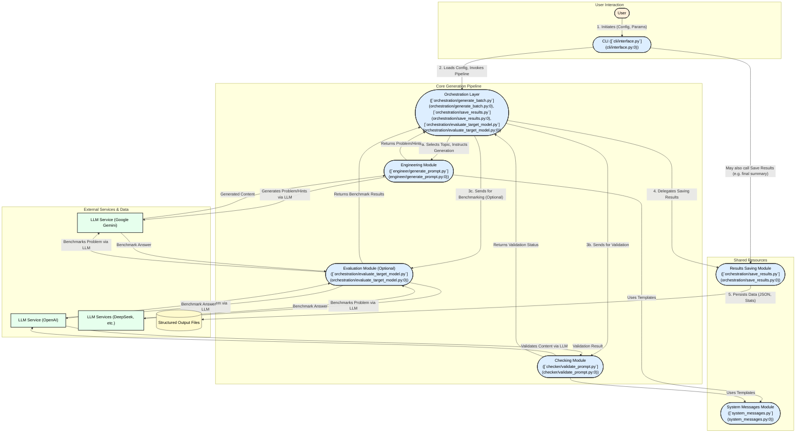
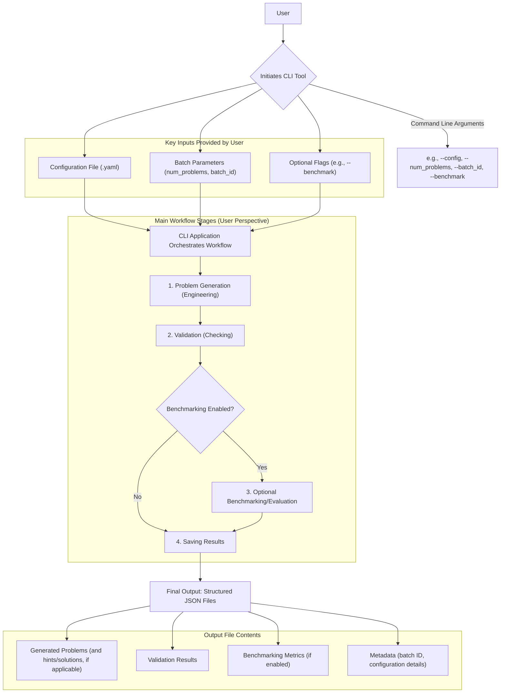

# Codebase Overview

This document provides a comprehensive overview of the synthetic math prompt generation tool, including its core modules, system architecture, and user workflows. It is intended to help developers, contributors, and users understand the structure, responsibilities, and operational flow of the codebase.

---

## Modules Overview

### Project Module Overview

This document provides detailed descriptions of each significant Python module in the codebase, outlining their primary purpose, key functions/classes, interactions, and dependencies.

---

#### [`system_messages.py`](system_messages.py)

**Primary Purpose:**  
Defines system prompt templates (as multi-line strings) for use with LLMs in various roles: problem engineering, hint generation, and answer checking.

**Key Functions/Classes:**  

- No functions or classes; contains string constants:
  - `ENGINEER_MESSAGE`: Instructions for generating challenging, well-formed math problems and hints.
  - `HINT_ONLY_MESSAGE`: Instructions for generating only hints for a given problem and answer.
  - `CHECKER_MESSAGE`: Instructions for validating the logical soundness of answers and hints.

**Interactions:**  
These message templates are imported and used by modules that interact with LLMs, such as `engineer/generate_prompt.py` and `checker/validate_prompt.py`.

**Dependencies:**  
None (pure string definitions).

---

#### [`checker/validate_prompt.py`](checker/validate_prompt.py)

**Primary Purpose:**  
Validates generated math problems and hints using an LLM (OpenAI), ensuring logical soundness and correctness.

**Key Functions/Classes:**  

- `call_openai(messages: List[Dict[str, str]]) -> dict`:  
  Sends a chat completion request to OpenAI and parses the JSON response.
- `validate_problem(problem_data: dict, mode="initial") -> dict`:  
  Prepares the prompt for the LLM based on the validation mode (initial or equivalence check), sends it to OpenAI using `call_openai`, and returns the result.

**Interactions:**  

- Imports `CHECKER_MESSAGE` from [`system_messages.py`](system_messages.py) for system prompt.
- Used by the orchestration pipeline to validate generated problems and hints.
- May be called by `orchestration/generate_batch.py`.

**Dependencies:**  

- External: `openai`, `dotenv`, `json`, `os`
- Internal: `system_messages.py`

---

#### [`cli/interface.py`](cli/interface.py)

**Primary Purpose:**  
Implements the command-line interface for running the synthetic prompt generation pipeline.

**Key Functions/Classes:**  

- `load_config(config_path)`: Loads YAML configuration files.
- `main()`:  
  - Parses CLI arguments (config path, batch ID, number of problems, target provider/model).
  - Loads and updates configuration.
  - Runs the generation pipeline and saves results.

**Interactions:**  

- Calls `run_generation_pipeline` from [`orchestration/generate_batch.py`](orchestration/generate_batch.py).
- Calls `save_prompts` from [`orchestration/save_results.py`](orchestration/save_results.py).
- Loads configuration from YAML files.

**Dependencies:**  

- External: `argparse`, `yaml`, `pathlib`
- Internal: `orchestration.generate_batch`, `orchestration.save_results`

---

#### [`engineer/generate_prompt.py`](engineer/generate_prompt.py)

**Primary Purpose:**  
Generates new math problems and step-by-step hints using Google's Gemini LLM, and parses/cleans the LLM output.

**Key Functions/Classes:**  

- `safe_json_parse(raw_text)`:  
  Cleans and parses raw LLM output into valid JSON, handling code block markers and LaTeX escapes.
- `call_gemini(messages)`:  
  Sends a prompt to Gemini and parses the response as JSON.
- `generate_problem_shell(seed=None, subject=None, topic=None)`:  
  Constructs a user prompt (optionally with a seed example, subject, and topic) and generates a new problem using Gemini.

**Interactions:**  

- Imports prompt templates from [`system_messages.py`](system_messages.py).
- Used by the orchestration pipeline to generate problems and hints.
- May be called by `orchestration/generate_batch.py`.

**Dependencies:**  

- External: `google-generativeai`, `dotenv`, `os`, `json`, `re`
- Internal: `system_messages.py`

---

#### [`orchestration/evaluate_target_model.py`](orchestration/evaluate_target_model.py)

**Primary Purpose:**  
Evaluates how various LLMs (OpenAI, Gemini, DeepSeek) would answer a given math problem, supporting multiple providers.

**Key Functions/Classes:**  

- `model_attempts_answer(problem: str, model_config: dict) -> str`:  
  Given a problem and model configuration, sends the problem to the specified LLM provider and returns the model's answer.

**Interactions:**  

- Used by the orchestration pipeline to benchmark target models' performance on generated problems.
- May be called by `orchestration/generate_batch.py`.

**Dependencies:**  

- External: `openai`, `google-generativeai`, `requests`, `dotenv`, `os`, `json`
- Internal: None directly, but used by orchestration modules.

---

#### [`orchestration/generate_batch.py`](orchestration/generate_batch.py)

**Primary Purpose:**  
Coordinates the end-to-end pipeline for generating, validating, and collecting synthetic math problems and hints.

**Key Functions/Classes:**  

- `load_config(config_path)`: Loads YAML configuration.
- `run_generation_pipeline(config)`:  
  - Loops to generate the desired number of problems.
  - Randomly selects subject/topic.
  - Optionally uses a search module to get a seed prompt.
  - Calls `generate_problem_shell` and `generate_hints` from [`engineer/generate_prompt.py`](engineer/generate_prompt.py).
  - Validates problems using [`checker/validate_prompt.py`](checker/validate_prompt.py).
  - Optionally benchmarks target models using [`orchestration/evaluate_target_model.py`](orchestration/evaluate_target_model.py).
  - Tracks accepted and discarded problems.

**Interactions:**  

- Central orchestrator: interacts with engineer, checker, and evaluation modules.
- Optionally interacts with a search module for seed prompts.

**Dependencies:**  

- External: `yaml`, `pathlib`, `random`
- Internal: `engineer.generate_prompt`, `checker.validate_prompt`, `orchestration.evaluate_target_model`, optionally `search.web_search`

---

#### [`orchestration/save_results.py`](orchestration/save_results.py)

**Primary Purpose:**  
Handles saving the results of the generation pipeline to disk.

**Key Functions/Classes:**  

- `save_prompts(valid_list, discarded_list, save_path)`:  
  - Creates the output directory if needed.
  - Saves valid and discarded problems as JSON files.
  - Prints summary information.

**Interactions:**  

- Called by the CLI and orchestration pipeline to persist results.

**Dependencies:**  

- External: `os`, `json`, `pathlib`
- Internal: None

---

#### [`requirements.txt`](requirements.txt)

**Key External Dependencies:**

- LLM Clients: `openai`, `google-generativeai`
- Utilities: `python-dotenv`, `PyYAML`, `pandas`, `requests`
- CLI/Debug: `tqdm`

---

#### `__init__.py` Files

All `__init__.py` files in the listed directories are empty and serve only to mark the directories as Python packages.

---

## System Architecture

### System Architecture Overview

The synthetic math prompt generation tool is architected as a modular pipeline that automates the creation, validation, and benchmarking of synthetic math problems and hints using large language models (LLMs). The system is organized into several key components, each with a distinct responsibility, and is orchestrated to enable seamless data flow from user input to final output.

### Major Components and Their Roles

#### 1. Command-Line Interface (CLI)

- **Module:** [`cli/interface.py`](cli/interface.py)
- **Role:** Serves as the primary entry point for users. It parses command-line arguments (such as configuration file paths, batch IDs, and generation parameters), loads configuration files, and initiates the generation pipeline.
- **Interaction:** Invokes the orchestration layer to run the full prompt generation and validation process, and calls the results-saving module to persist outputs.

#### 2. Orchestration Layer

- **Modules:** [`orchestration/generate_batch.py`](orchestration/generate_batch.py), [`orchestration/save_results.py`](orchestration/save_results.py), [`orchestration/evaluate_target_model.py`](orchestration/evaluate_target_model.py)
- **Role:** Acts as the central coordinator for the entire workflow. It manages the iterative process of generating, validating, and (optionally) benchmarking math problems and hints.
- **Key Functions:**
  - Loads and manages configuration.
  - For each problem to be generated:
    - Selects subject/topic (optionally using a search module for seed prompts).
    - Calls the engineering module to generate new problems and hints.
    - Validates generated content using the checking module.
    - Optionally benchmarks target LLMs on the generated problems.
    - Tracks and categorizes accepted and discarded problems.
  - Delegates saving of results to the appropriate module.

#### 3. Engineering Module

- **Module:** [`engineer/generate_prompt.py`](engineer/generate_prompt.py)
- **Role:** Responsible for generating new math problems and step-by-step hints using LLMs (primarily Google's Gemini). It constructs prompts (using templates from the system messages module), sends them to the LLM, and parses/cleans the responses into structured data.
- **Interaction:** Receives instructions and parameters from the orchestration layer and returns generated problems and hints for further processing.

#### 4. Checking Module

- **Module:** [`checker/validate_prompt.py`](checker/validate_prompt.py)
- **Role:** Validates the logical soundness and correctness of generated problems and hints using an LLM (OpenAI). It prepares validation prompts (using templates from the system messages module), sends them to the LLM, and interprets the results.
- **Interaction:** Called by the orchestration layer to ensure only high-quality, logically sound problems and hints are accepted.

#### 5. System Messages Module

- **Module:** [`system_messages.py`](system_messages.py)
- **Role:** Provides reusable prompt templates for various LLM interactions (problem engineering, hint generation, answer checking). These templates are imported by both the engineering and checking modules to ensure consistent and effective communication with LLMs.

#### 6. Evaluation Module (Optional)

- **Module:** [`orchestration/evaluate_target_model.py`](orchestration/evaluate_target_model.py)
- **Role:** Benchmarks how different LLMs (OpenAI, Gemini, DeepSeek) would answer the generated math problems. This supports comparative evaluation of model performance.
- **Interaction:** Invoked by the orchestration layer as part of the pipeline, if benchmarking is enabled.

#### 7. Results Saving Module

- **Module:** [`orchestration/save_results.py`](orchestration/save_results.py)
- **Role:** Handles the persistence of both valid and discarded problems/hints to disk in structured formats (e.g., JSON). Also provides summary statistics of the generation process.
- **Interaction:** Called by both the CLI and orchestration layer to save outputs at the end of a batch run.

### Data Flow and Interactions

1. **User Initiation:**  
   The user starts the process via the CLI, specifying configuration and generation parameters.

2. **Configuration Loading:**  
   The CLI loads the specified YAML configuration and passes control to the orchestration layer.

3. **Batch Generation Loop:**  
   The orchestration layer iterates to generate the desired number of problems:
   - **Subject/Topic Selection:** Randomly selects or seeds a subject/topic for each problem.
   - **Problem & Hint Generation:** Calls the engineering module, which uses LLMs (with system message templates) to generate a new math problem and associated hints.
   - **Validation:** Passes the generated content to the checking module, which uses an LLM to validate logical soundness and correctness.
   - **Benchmarking (Optional):** If enabled, the evaluation module sends the problem to various LLMs and records their answers for benchmarking.
   - **Result Categorization:** Problems and hints are categorized as accepted or discarded based on validation results.

4. **Results Saving:**  
   At the end of the batch, the orchestration layer (or CLI) calls the results saving module to persist both valid and discarded problems/hints, along with summary statistics.

5. **Output:**  
   The user receives structured output files containing the generated and validated math problems and hints, ready for downstream use or analysis.

### External Dependencies

- **LLM Services:**  
  - OpenAI (for validation and benchmarking)
  - Google Gemini (for problem and hint generation, and benchmarking)
  - DeepSeek (for benchmarking)
- **Utilities:**  
  - Configuration management (`PyYAML`)
  - Environment variable loading (`python-dotenv`)
  - Data handling (`json`, `os`, `pathlib`)
  - Progress reporting (`tqdm`)

### Summary

The system is designed as a modular, extensible pipeline that leverages LLMs for the automated generation and validation of synthetic math problems and hints. The architecture cleanly separates concerns between user interaction (CLI), orchestration, problem engineering, validation, benchmarking, and results persistence. Data flows sequentially through these components, with each module focused on a specific aspect of the workflow, enabling robust, scalable, and maintainable synthetic prompt generation.

Below is a diagram representing the system architecture:



---

## User Workflows

### User Workflows for the Synthetic Math Prompt Generation Tool

The synthetic math prompt generation tool is a command-line interface (CLI) application that enables users to generate, validate, and optionally benchmark synthetic math problems through an automated pipeline. The primary user interaction is via the CLI, which orchestrates the workflow as follows:

1. **Initiating the Process**
   - Users start the tool from the command line, typically with a command like:

     ```bash
     python -m cli.interface --config config/settings.yaml --num_problems 100 --batch_id batch_01
     ```

   - The CLI accepts arguments such as:
     - Configuration file path (e.g., `--config config/settings.yaml`)
     - Number of problems to generate (e.g., `--num_problems 100`)
     - Batch identifier (e.g., `--batch_id batch_01`)
     - Optional flags (e.g., `--benchmark`) to enable or disable benchmarking

2. **Key Inputs Provided by the User**
   - **Configuration file**: Specifies system parameters, model settings, and output locations
   - **Batch parameters**: Number of problems, batch ID, and related metadata
   - **Optional flags**: Control workflow variations, such as enabling benchmarking

3. **Main Workflow Stages**
   - **a. Problem Generation (Engineering)**
     - The system uses LLMs to generate synthetic math problems and, if configured, hints or solutions.
   - **b. Validation (Checking)**
     - Each problem is validated for correctness and clarity using LLM-based routines.
   - **c. Optional Benchmarking/Evaluation**
     - If enabled, the system evaluates problems using target models to assess metrics like difficulty or solvability.
   - **d. Saving Results**
     - The validated (and optionally benchmarked) problems are saved to disk, typically as JSON files, organized by batch ID and configuration.

4. **Final Output**
   - Users receive output files (e.g., JSON) containing:
     - Generated problems (and hints/solutions, if applicable)
     - Validation results
     - Benchmarking metrics (if enabled)
     - Metadata such as batch ID and configuration details

5. **Workflow Variations**
   - **With Benchmarking Enabled**: The evaluation stage is included, and output files contain benchmarking results.
   - **Without Benchmarking**: Only generation and validation are performed.
   - **Custom Configurations**: Users can adjust the configuration file to tailor model parameters, output formats, or validation criteria.

### Summary

Users interact with the tool via the CLI, providing configuration and batch parameters to control the workflow. The system automates generation, validation, optional benchmarking, and saving of synthetic math problems, producing structured output files for further use or analysis.

Below is a diagram representing the typical user workflow:


