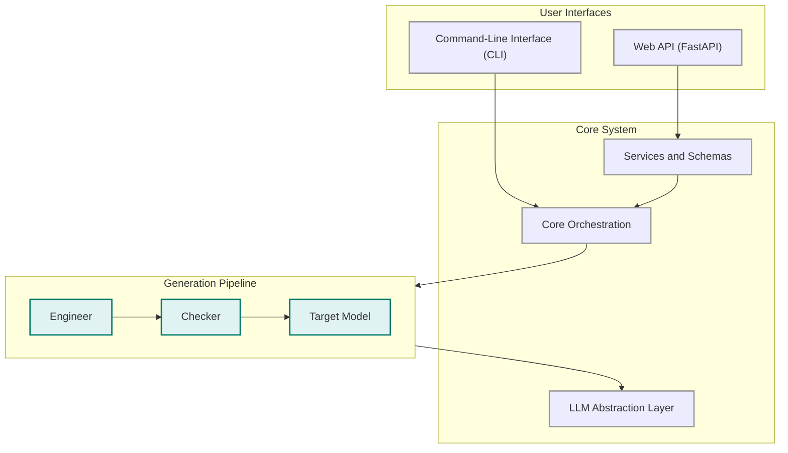
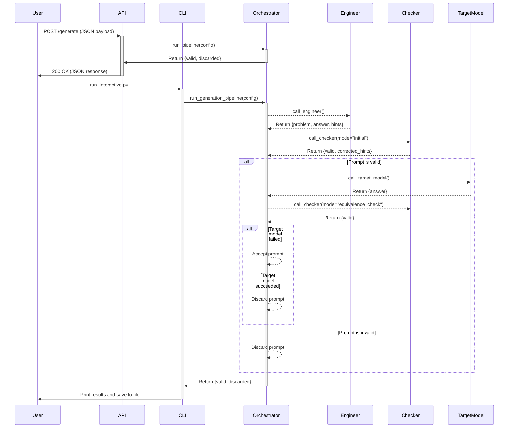

# Project Overview

This project is a synthetic math prompt generation pipeline. Its primary purpose is to generate high-quality math problems that are difficult for large language models (LLMs) to solve correctly. The system is designed to be modular and extensible, with a clear separation of concerns between the different components.

## Directory Structure

### `app`

The `app` directory contains a FastAPI web application that exposes the core functionality of the project through a RESTful API.

- **`main.py`**: The entry point for the FastAPI application.
- **`api/routes.py`**: Defines the API endpoints, including the main `/generate` endpoint for creating new prompts.
- **`services/pipeline_service.py`**: Acts as a bridge between the API and the core application logic, translating API requests into calls to the `core` module.
- **`models/schemas.py`**: Defines the data models and schemas for API requests and responses.

### `core`

The `core` directory is the heart of the application, containing the main logic for the prompt generation pipeline.

- **`runner.py`**: The main entry point for the core logic, responsible for orchestrating the entire prompt generation process.
- **`orchestration`**: Manages the workflow of generating, validating, and evaluating prompts. It uses a parallel execution model to improve performance.
- **`engineer`**: Responsible for generating the initial math problems using an LLM.
- **`checker`**: Validates the generated prompts for correctness and logical soundness, also using an LLM.
- **`llm`**: Provides a unified interface for interacting with different LLM providers, such as OpenAI and Gemini.
- **`cli`**: A command-line interface for running the prompt generation pipeline interactively.
- **`search`**: Contains functionality for web searches to find seed content for prompt generation.

### `utils`

The `utils` directory contains a collection of helper functions and utility modules that are used throughout the project.

- **`config_loader.py`**: Loads configuration files.
- **`costs.py`**: Tracks the costs associated with LLM API calls.
- **`domain_taxonomy.json`**: A JSON file defining the taxonomy of subjects and topics for prompt generation.
- **`helpers.py`**: General-purpose helper functions.
- **`json_utils.py`**: Utilities for working with JSON data.
- **`save_results.py`**: Saves the generated prompts to disk.
- **`system_messages.py`**: Contains the system prompts that define the behavior of the LLMs.
- **`validation.py`**: Provides functions for data validation.

### `config`

The `config` directory contains the main configuration file for the application.

- **`settings.yaml`**: Defines the default parameters for the prompt generation pipeline, including the number of problems to generate, the models to use, and the taxonomy of subjects.

### `docs`

The `docs` directory contains project documentation.

- **`overview.md`**: This file, providing a high-level overview of the project.

---

## System Architecture

The application is a synthetic prompt generation system designed to produce high-quality, validated prompts for evaluating language models. It is built with a modular architecture that separates concerns between the user-facing interfaces (a web API and a command-line interface), the core orchestration logic, and the underlying language model interactions.

### Key Components

- **Entry Points:** The system offers two primary ways to initiate the prompt generation process:
  - **Web API:** A FastAPI application, defined in `app/main.py`, provides a RESTful interface for generating prompts. It exposes a `/generate` endpoint that accepts a JSON payload specifying the generation parameters. The API routes are defined in `app/api/routes.py`, and the request/response data structures are defined using Pydantic models in `app/models/schemas.py`.
  - **Command-Line Interface (CLI):** An interactive CLI, implemented in `core/cli/run_interactive.py`, allows users to run the generation pipeline directly from the terminal. It provides prompts for customizing the generation parameters or using the defaults from the configuration file.

- **Configuration:** The application's behavior is configured through a central YAML file, `config/settings.yaml`. This file defines default parameters such as the number of problems to generate, the models to use for each stage of the pipeline, and the taxonomy of subjects and topics for prompt generation.

- **Core Orchestration:** The heart of the system is the orchestration layer, managed by `core/orchestration/generate_batch.py`. This component is responsible for running the end-to-end prompt generation pipeline. It uses a multi-threaded approach with a `ThreadPoolExecutor` to generate and validate multiple prompts in parallel, significantly speeding up the process.

- **Generation Pipeline:** The core pipeline consists of a sequence of steps that leverage different language models to generate, validate, and test the synthetic prompts:
    1. **Engineer:** A "generator" model (e.g., `gemini-2.5-pro`) creates an initial problem, answer, and hints based on a given subject and topic.
    2. **Checker (Initial Validation):** A "checker" model (e.g., `o3-mini`) validates the generated problem for clarity, correctness, and adherence to guidelines. It can also correct the hints if necessary.
    3. **Target Model Evaluation:** The "target" model (e.g., `o1`) attempts to solve the validated problem.
    4. **Checker (Equivalence Check):** The checker model evaluates the target model's answer to determine if it is correct. The prompt is "accepted" if the target model fails to answer correctly, as this indicates the prompt is sufficiently challenging.

- **LLM Abstraction:** The system abstracts the interactions with different language models through a dispatch layer in `core/llm/llm_dispatch.py`. This component provides wrapper functions (`call_engineer`, `call_checker`, `call_target_model`) that route the calls to the appropriate model-specific implementation based on the configuration.

- **Services and Schemas:** The API is structured with a service layer (`app/services/pipeline_service.py`) that acts as a bridge between the API routes and the core runner. It translates the incoming API request into the configuration format expected by the pipeline. Pydantic schemas in `app/models/schemas.py` ensure that the data exchanged through the API is well-structured and validated.

- **Utilities:** The application is supported by a set of utility modules that handle tasks such as cost tracking (`utils/costs.py`), saving results to disk (`utils/save_results.py`), and loading configuration (`utils/config_loader.py`).

### Primary User Workflow

The following Mermaid.js diagram illustrates the primary user workflow, from initiating a request to the final output.

